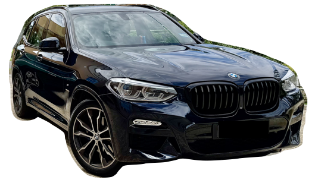

> 🚗💨 Two Premium Cars for Sale in Brunei — Grab Them Before They're Gone!

{.preview-image}

Looking for a ride that turns heads *and* delivers performance? You're in the right place. I'm selling **two meticulously maintained, low-mileage, high-spec cars** — a **BMW X3 (G01) M Sport** and a **Mini Cooper S 60 Years Edition**.

Each car has full OEM service history at **QAF Auto Sdn Bhd**, lovingly cared for, and barely used for their age. ✨

::: callout
### 📝 Reason for Sale (RFS)

Relocating overseas for work — cars are no longer needed.
:::

------------------------------------------------------------------------

## 🔥 BMW X3 (G01) 2019 xDrive30i M Sport — CUSTOM BUILD, UNIQUE IN BRUNEI!

**💰 Asking Price:** BND <s>58,000</s> **48,000** ono \[approx. BND 763/mo\]\
**🛠 Original Price:** BND 118,000\
**📍 Mileage:** 65,000+ km\
**🎨 Colour:** Carbon Black\
**🪑 Interior:** Leather Merino Tartufo + Sensatec dash\
**🚀 Performance:** 2.0L B48 turbo petrol (348hp/350Nm) \| 0–100 km/h in 6.4s\
**🛞 Wheels:** 20” double-spoke 699 M runflats + M Sport Brakes

### 🏁 Key Features:

-   ✅ M Sports Package + M Aerodynamics Kit\
-   ✅ Adaptive LED Headlights\
-   ✅ Adaptive Suspension\
-   ✅ Heads-Up Display\
-   ✅ Apple CarPlay + Parking Assistant Plus\
-   ✅ Panoramic Glass Roof + Rear Door Roller Sun Visors\
-   ✅ M Leather Steering Wheel + Sports Seats

### 🧰 Extras Included:

-   OEM black kidney grille 💀\
-   OEM acoustic glass (driver + passenger)\
-   OEM All-Weather Floor Mats + Cargo Mat\
-   OEM Floating Center Caps ✨\
-   3M Crystalline Series 90 tint (incl. sunroof) 😎\
-   70mai front & rear dashcam\
-   🔧 Full service history at BMW QAF

> 🏆 This is a **custom configuration not available in Brunei** — a rare gem. Perfect blend of **sportiness, luxury**, and **practicality**. A head-turner in every way.

### 🔍 FYI / Full Disclosure

This is a well-loved car, and I believe in being upfront with prospective buyers. Here are some honest imperfections to note:

-   ⚠️ Small **paint rash** on the **front right bumper** (light scuff from lightly grazing a wall — **no dents or bends**)\
-   ⚠️ Minor **curb rash** on the **right rear wheel**\
-   ⚠️ **Leather seat wear** on the **left rear passenger side** — repaired as best as possible
-   ⚠️ **Small dent** on the **passenger door (right side)** — caused by road debris, hardly visible unless up close

## 🍀 Mini Cooper S (F56) 2019 Hatchback — 60 YEARS SPECIAL EDITION!

**💰 Asking Price:** BND <s>35,000</s> **29,000** ono \[approx. BND 462/mo\]\
**🛠 Original Price:** BND 65,000\
**📍 Mileage:** 47,000+ km\
**🎨 Colour:** British Racing Green IV\
**🪑 Interior:** 60 Years Dark Maroon Leather\
**🚀 Performance:** 2.0L B48C petrol (189hp) \| 0–100 km/h in 8.2s\
**🛞 Wheels:** 17” 60 Years spoke 2-tone runflats

### 🎉 Edition-Specific Features:

-   ✅ 60 Years Insignia Package (lights, stripes, scuttles)\
-   ✅ LED Headlights, Fog Lights, Rear Fog\
-   ✅ Park Distance Control (rear) + Backup Camera\
-   ✅ Apple CarPlay + Sports Seats\
-   ✅ Lounge-style leather interior exclusive to the edition\
-   ✅ Full service history at BMW QAF

> 🎂 Built to celebrate 60 years of MINI heritage — this is **not your ordinary hatch**. Perfect for the style-conscious urban driver who appreciates punchy performance and standout design.

### 🔍 FYI / Full Disclosure

This is a well-loved car, and I believe in being upfront with prospective buyers. Here are some honest imperfections to note:

-   ⚠️ **Small dent** on the **rear hatch door** — likely caused by road debris, purely cosmetic

## 📞 Interested?

Reach out now before someone else grabs them!\
Contact Haziq \[WhatsApp: 7171144\].\
These aren't just cars — they're experiences on wheels. 💫
